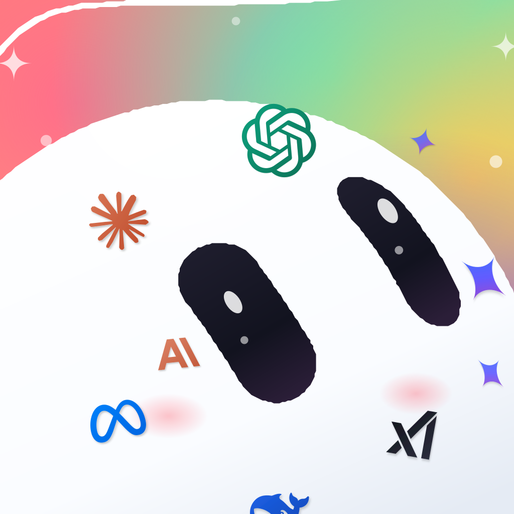

<p align="center">
  
</p>

# Prepare to get grok"D"!

A custom Grok Bot for your Mac. Run bots locally, or sign in with your Cursor account. You can add more than one Cursor login.

This repo is the overlay. Official Grok Bot is xAI’s. `install.sh` copies the Grok Bot already on your Mac, patches it, and opens grok"D". xAI’s binary is not in here.

Need macOS, official Grok Bot, and Node. Local models also need a proxy on this Mac (OpenBurnBar, CLI Proxy, or Vibe). Cursor-only users can skip the proxy.

For a new install, this is the whole command:

```bash
git -c credential.helper= clone --depth=1 https://github.com/Imagine-That-Ai/grokD.git ~/.grok/grokbot-d && bash ~/.grok/grokbot-d/install.sh --replace
```

If you already cloned the repo, run `bash install.sh --replace` inside it.

That writes `~/Applications/Grok Bot D.app` and opens it. If this Mac has Imagine That’s Developer ID, it signs with that. Otherwise it ad-hoc signs a local build from *your* Grok Bot. Do not email an ad-hoc `.app`. Gatekeeper will block it.

First launch is offline-safe after installation: it extracts the local host directly from the bundled `app.asar`, verifies every required host file, and waits for the host and gateway to pass readiness checks before opening the UI. A bootstrap failure exits with a macOS alert and diagnostics under `~/.grok/grokbot-d/runtime/`; it never leaves “Setting up your Grok Bot…” spinning forever.

This Mac mode never constructs the official Cursor auth service or opens its Keychain storage. Local secrets use a random per-seat 256-bit key with owner-only permissions, so a fresh clone and locally signed app cannot inherit another user’s account lock. Cursor mode keeps the official sign-in and Keychain behavior.

When an official bot runs out of quota, click **Local copy** in its bottom-left account chip. D identifies the exact selected bot from official persistence, creates or resumes one temporary Local D continuation, and leaves the official bot, cloud history, login, routines, and files unchanged. **Back to official** prepares a bounded reviewable context packet and never presses Send; **Keep** or **Discard & return** controls the local copy.

Before the local host starts, D verifies every existing local bot database and repairs the older two-column transcript shape without dropping readable duplicate-ID rows. New bot directories remain hidden until every required file is complete, then publish atomically. An unknown store stops startup with diagnostics instead of opening a bot that can get stuck.

If you were given a notarized drop (`./pack-drop.sh` on a signing Mac), drag that icon into Applications. First open finds official Grok Bot, builds D, and relaunches. GitHub does not host that `.app`.

First launch is Seat in. Pick This Mac (local box), Cursor (import or sign in), or add another Cursor after the first one. Skip anytime. Tokens stay on your Mac.

[CubeLove](https://cubelove.ai) is live on iPhone. grok"D" on the phone is not yet. Want updates on mobile builds? Visit [Imagine That](https://imagine-that.ai).

Guides: [`splash/onboarding-apple.html`](splash/onboarding-apple.html), [`welcome_guide_source.html`](welcome_guide_source.html).

Dock name is grok"D". The canonical folder is `Grok Bot D.app`; the installer leaves `grok"D".app` only as a compatibility symlink. Cursor mode keeps the `Grok Bot` Apple-menu and Keychain identity. Do not replace the canonical folder with the quoted legacy name — quotes in the real bundle path crash Electron.

You start on Local D. Grok A is an optional import of official Grok Bot on this Mac. Official Grok B and C are not seats.

Cursor allows one computer. If official Grok already owns this Mac, grok"D" may show no computer until you Recover or sign in. The overlay will not click Recover for you.

Do not zip `~/.grok/grokbot-d/profile-data` or `~/Library/Application Support/GrokBotSeat4` when you send the app to someone else. That is your login.

Overlay is MIT. Official Grok Bot stays xAI’s. Provider marks in the welcome guide belong to their owners. Not affiliated with xAI, SpaceX, or Cursor.
