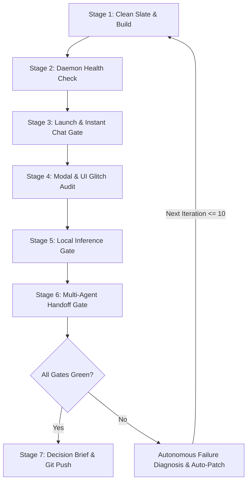

# Workflow Spec: Grok "D" Mac Mini Autonomous Test & Repair Loop

## 1. Goal & Execution Lens
An autonomous, self-healing end-to-end iteration loop that validates Grok "D" on the Apple Silicon Mac Mini (`dewclaw@mini`). The loop repeatedly executes clean wipes, builds, code signing, daemon orchestrations, UI assertions via Chrome DevTools Protocol (CDP), local LLM inference, and multi-bot handoff verification. If any failure occurs, the loop automatically diagnoses the root cause, applies code fixes, redeploys, and iterates (up to 10 automated rounds) until all verification gates pass cleanly with zero manual intervention.

---

## 2. Trigger & Prerequisites
- **Trigger**: Direct execution via `bash run-loop.sh` or automated test dispatch.
- **SSH Target**: `dewclaw@mini`
- **Key Credentials**: Keychain unlocked via `security unlock-keychain -p "TwerpBitch" ~/Library/Keychains/login.keychain-db`.
- **Target Directories**:
  - Source Bundle: `/Applications/Grok Bot.app`
  - Destination: `/Users/dewclaw/Applications/Grok Bot D.app`
  - Runtime Root: `/Users/dewclaw/.grok/grokbot-d`
  - User Data Dir: `~/Library/Application Support/GrokBotSeat4`
  - CDP Port: `9224`

---

## 3. The 7-Stage Iteration Lifecycle



### Stage 1: Clean Slate & Production Build
1. Kill all existing instances and child processes on Mini (`pkill -9 -f "Grok Bot|gateway-shim|runbox|proxy2|fakebox|routine-guard|host-main"`).
2. Clean `~/Applications/Grok Bot D.app`, `~/.grok/grokbot-d`, `~/Library/Application Support/GrokBotSeat4`, and `/tmp/grokbot-*`.
3. Unpack official `app.asar`, apply main process and preload hooks, repack, and sign with Developer ID (`Imagine That AI Limited Liability Company (4Y367DF25B)`), falling back to ad-hoc if keychain is locked.

### Stage 2: Daemon Health & Port Binding
1. Start `ensure-local-box.sh`.
2. Assert active listeners:
   - `1337` (gateway-shim router)
   - `1338` (runbox / host-main)
   - `8787` (proxy2 tool & inference bridge)
   - `1340` (fakebox container emulator)
   - `11434` (Ollama provider hosting `deepseek-v4-pro:cloud`)
3. Assert `POST http://127.0.0.1:1337/api/getStatus` returns `{"ok":true,"status":"idle","mode":"local","connected":true}`.

### Stage 3: Launch & Instant Start Gate
1. Launch `Grok Bot D.app` with `--remote-debugging-port=9224`.
2. Evaluate DOM via CDP within 1.5 seconds:
   - **Assert**: Chat surface is mounted (`composer: true`).
   - **Assert**: Default bot `Local D` is present in sidebar without waiting for cloud creation.
   - **Assert**: Zero "Getting your team ready..." spinners or landing page hangs.

### Stage 4: Cloud Modal & UI Glitch Audit
1. Query DOM via CDP for false-alarm modals and layout bugs:
   - **Hard Fail** if `.sand-computer-couldnt-reach-dialog` or `[data-ui-dialog-root]` containing "Recover Grok Bot" / "Couldn't Reach Computer" is visible.
   - **Hard Fail** if "Reconnecting" banner pill is visible in header.
   - **Hard Fail** if `#gd-scheme-toggle` ("LIGHT" button) is mounted fixed inside the chat window.
   - **Hard Fail** if message rows undergo continuous re-render flicker loops during text updates.

### Stage 5: Local Inference & Streaming Gate
1. Send calculation/reasoning prompt via gateway:
   ```json
   { "agentId": "d0000000-0000-0000-0000-000000000001", "prompt": "What is 15 * 12? Reply with only the number." }
   ```
2. Monitor `proxy2.out` stream and CDP DOM.
3. **Assert**: Assistant message `180` is received and persisted in SQLite `store.db`.

### Stage 6: Multi-Agent Handoff & Tool Deduplication Gate
1. Create secondary bot `Beta Bot` (`POST /api/createAgent`).
2. Send collaborative multi-step task prompt to `Local D`:
   - Step 1: Run shell command (`df -h && top -l 1`).
   - Step 2: Handoff diagnostics to `Beta Bot` via `SendToAgent`.
   - Step 3: `Beta Bot` creates `fleet_status.md` and verifies file.
3. **Assert**: `Beta Bot` receives the `[Bot-to-bot from Local D]` message **exactly once** (zero duplicate dispatches across multi-round tool loops).
4. **Assert**: `fleet_status.md` exists on disk with formatted health metrics.

---

## 4. Autonomous Self-Healing Protocol (Budget: 10 Iterations)
When any gate fails:
1. **Capture Evidence**: Dump CDP DOM tree snapshot, `proxy2.out`, `gateway-shim.log`, and renderer console logs.
2. **Classify Failure**:
   - *UI/CSS Leak* -> Patch `profile-ui-inject.js` or `computer-cover.js`.
   - *Handoff Duplication* -> Patch `sentHandoffsInLoop` in `proxy2.js`.
   - *Gateway Reconnecting* -> Patch status route handler in `gateway-shim.js`.
   - *Codesign Failure* -> Unlock keychain or apply ad-hoc fallback in `install.sh`.
3. **Deploy & Re-run**: Push updated files via `scp`, restart daemons, reload renderer, and re-execute all gates.
4. **Budget**: If all gates pass, exit green. If failures persist after 10 iterations, produce an alert brief.

---

## 5. Checkpoint Brief Definition
When the loop concludes (or when maximum budget is reached), the workflow produces a Decision Brief containing:
- Total iterations run and elapsed time.
- Verification matrix (all 6 gates: Build, Daemons, Instant Start, Modal Audit, Inference, Deduplicated Handoffs).
- Before & After diff summary.
- Git commit hash on `Imagine-That-Ai/grok-D` `main`.
